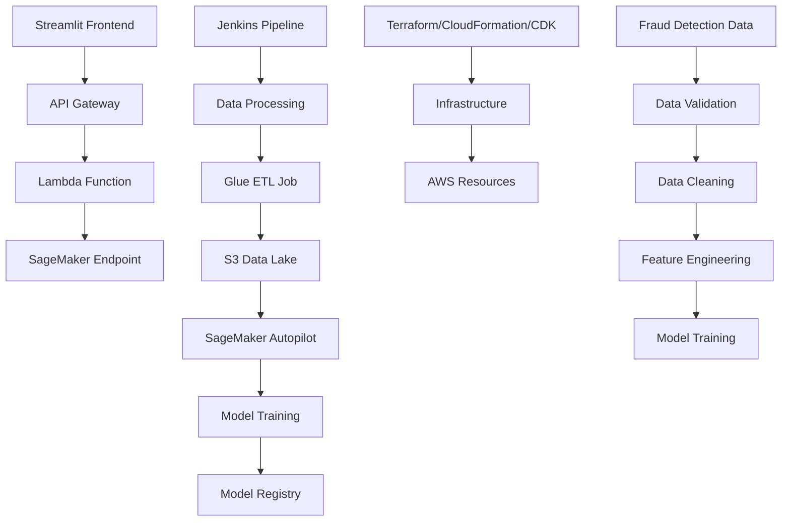

# Credit Card Fraud Detection with AWS SageMaker Autopilot

This project implements an automated credit card fraud detection system using AWS SageMaker Autopilot, with CI/CD pipelines using Jenkins, and infrastructure as code using Terraform, CloudFormation, and AWS CDK.

## Architecture Overview



## Project Components

1. **Data Processing Pipeline**
   - AWS Glue ETL jobs for data cleaning
   - PySpark for data transformation
   - S3 for data storage

2. **Machine Learning Pipeline**
   - SageMaker Autopilot for automated model training
   - Model registry for versioning
   - Automated model deployment

3. **Infrastructure as Code**
   - Terraform for AWS resource provisioning
   - CloudFormation templates for specific services
   - AWS CDK for application infrastructure

4. **CI/CD Pipeline**
   - Jenkins for continuous integration
   - Automated testing and deployment
   - Model monitoring and retraining

5. **Frontend Application**
   - Streamlit-based user interface
   - Real-time fraud detection
   - Model performance monitoring

## Project Structure

```
fraud-autopilot-sagemaker/
├── data/
│   ├── raw/
│   └── processed/
├── infrastructure/
│   ├── terraform/
│   ├── cloudformation/
│   └── cdk/
├── ml_pipeline/
│   ├── glue_jobs/
│   ├── autopilot/
│   └── monitoring/
├── frontend/
│   └── streamlit/
├── jenkins/
│   └── pipeline/
└── tests/
```

## Setup Instructions

1. **Prerequisites**
   - AWS Account with appropriate permissions
   - Jenkins server
   - Python 3.8+
   - Terraform
   - AWS CDK CLI

2. **Infrastructure Deployment**
   ```bash
   cd infrastructure/terraform
   terraform init
   terraform plan
   terraform apply
   ```

3. **Data Processing Setup**
   ```bash
   cd ml_pipeline/glue_jobs
   aws glue create-job --cli-input-json file://glue-job.json
   ```

4. **Frontend Deployment**
   ```bash
   cd frontend/streamlit
   streamlit run app.py
   ```

## Data Generation

The project includes synthetic credit card fraud data generation scripts that create realistic transaction data with the following features:
- Transaction amount
- Time of transaction
- Merchant category
- Cardholder information
- Location data
- Fraud labels

## Monitoring and Maintenance

- Model performance monitoring using SageMaker Model Monitor
- Automated retraining triggers based on data drift
- Alert system for model degradation
- Cost optimization recommendations

## Security Considerations

- IAM roles and policies
- VPC security groups
- Encryption at rest and in transit
- Secrets management
- Audit logging

## Contributing

Please read CONTRIBUTING.md for details on our code of conduct and the process for submitting pull requests.

## License

This project is licensed under the MIT License - see the LICENSE.md file for details. 